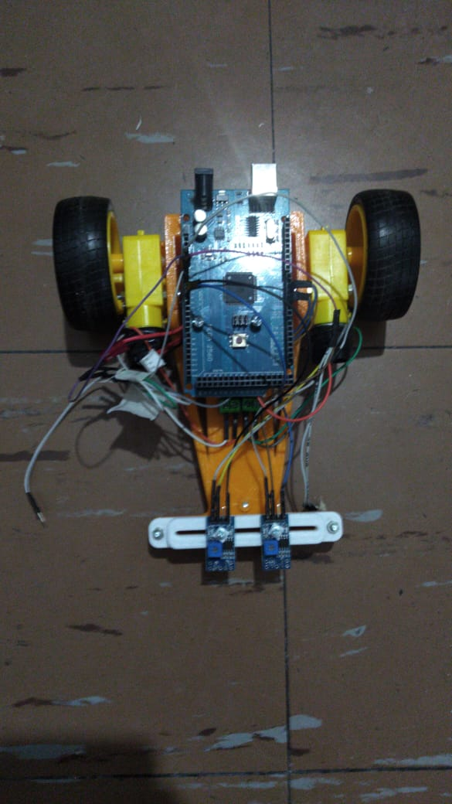

# IEEE RAS UTN-FRBA

## Proyecto 

Robot Educativo Velocista - Seguidor de linea

## Autores: 

Marcelo Acevedo, Elias Reuter.

## Robot: Velocista v0.2

## Componentes
  - Motor: amarillo 6v.
  - Placa control Arduino UNO (actual Mega para pruebas).
  - Sensor: TRCT5000 plava azul - sensor perpendicular.

## Videos didacticos

-> AGREGAR LINKS

